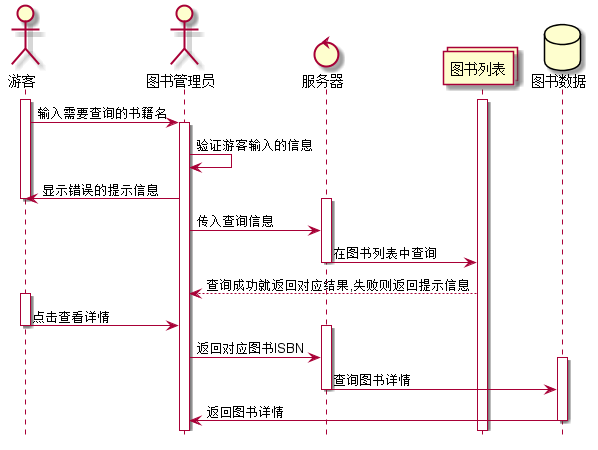
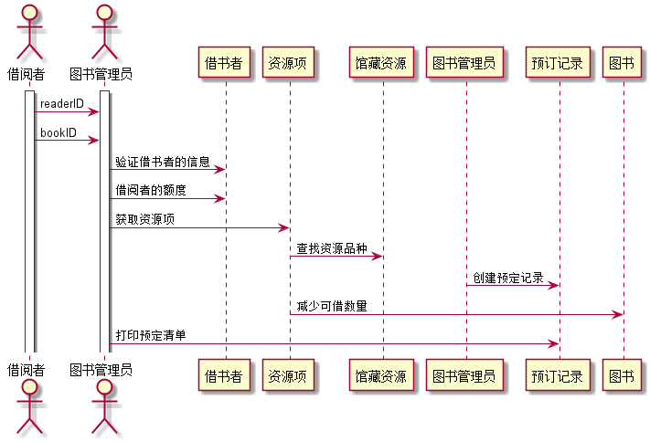
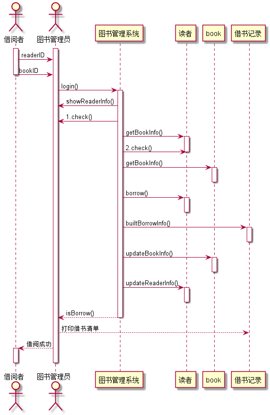
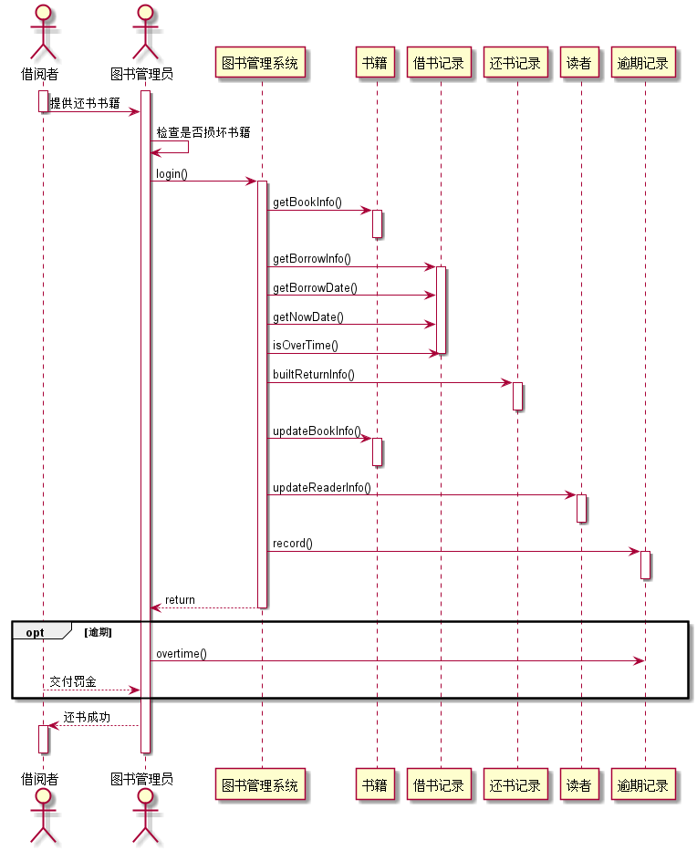

# 实验4：图书管理系统顺序图绘制

|学号|班级|姓名|
|:---------------:|:------------:|:------------:|
|201510511127|软件15-1|张继|

## 图书管理系统的顺序图


## 1. 图书查询用例
### 1.1 图书查询用例PlantUML源码

```

@startuml
hide footbox
actor 游客
actor 图书管理员
control 服务器
collections 图书列表
database 图书数据

activate 游客
activate 图书列表
游客 -> 图书管理员: 输入需要查询的书籍名
activate 图书管理员
图书管理员 -> 图书管理员: 验证游客输入的信息
图书管理员 -> 游客: 显示错误的提示信息
deactivate 游客
activate 服务器
图书管理员 -> 服务器: 传入查询信息
服务器 -> 图书列表: 在图书列表中查询
deactivate 服务器
图书列表 --> 图书管理员: 查询成功就返回对应结果,失败则返回提示信息
activate 游客
游客 -> 图书管理员: 点击查看详情
deactivate 游客
activate 服务器
图书管理员 -> 服务器: 返回对应图书ISBN
activate 图书数据
服务器 -> 图书数据: 查询图书详情
deactivate 服务器
图书数据 -> 图书管理员: 返回图书详情
deactivate 图书数据
@enduml

```
#### 1.2 图书查询用例顺序图


#### 1.3 图书查询用例顺序图
```
1.图书管理员通过服务器验证游客的查询信息
2.服务器通过比对数据库中的信息进行反馈
...
```

## 2. 预借用例
### 2.1. 预借用例PlantUML源码

```

@startuml
actor  借阅者 as reader
actor  图书管理员 as admin
activate reader
activate admin
reader->admin:readerID
reader->admin:bookID

admin->借书者:验证借书者的信息
admin->借书者:借阅者的额度
admin->资源项:获取资源项
资源项->馆藏资源:查找资源品种
图书管理员->预订记录:创建预定记录
资源项->图书:减少可借数量
admin->预订记录:打印预定清单
@enduml


```

### 2.2.预借用例顺序图



## 2.3. 预借图书用例顺序图说明
```
1.验证借书者的信息以及日期额度
2.图书管理员发起预借请求
3.减少资源可借数量和可借额度
4.创建借书记录

```


## 3. 借书用例
### 3.1. 借书用例PlantUML源码

``` sequence
@startuml
actor  借阅者 as reader
actor  图书管理员 as admin
activate reader
activate admin
reader->admin:readerID
reader->admin:bookID

deactivate reader
admin->图书管理系统:login()
activate 图书管理系统
admin<-图书管理系统:showReaderInfo()
admin<-图书管理系统:1.check()
图书管理系统->读者:getBookInfo()
activate 读者
图书管理系统->读者:2.check()
deactivate 读者
图书管理系统->book:getBookInfo()
activate book
deactivate book
图书管理系统->读者:borrow()
activate 读者
deactivate 读者
图书管理系统->借书记录:builtBorrowInfo()
activate 借书记录
deactivate 借书记录
图书管理系统->book:updateBookInfo()
activate book
deactivate book
图书管理系统->读者:updateReaderInfo()
activate 读者
deactivate 读者
图书管理系统-->admin:isBorrow()
deactivate 图书管理系统
admin-->借书记录:打印借书清单
admin-->reader:借阅成功

activate reader
deactivate reader
deactivate admin
@enduml


```

## 3.2. 借书用例顺序图


## 3.3. 借书用例顺序图说明
```
1. login()：借阅者把需借图书和借书卡号提供给图书管理员，图书管理员登陆图书管理系统函数。
2. showReaderInfo()：登录系统后通过借书卡号显示该借阅者的信息函数。
3. check()：检查该借阅者的合法性函数。
4. getReaderInfo()：获取读者的相关信息函数。
5. check()：检查该读者的借书限额，是否超限的函数。
6. getBookInfo()：获取需借图书的相关信息函数。
7. borrow()：借阅者的借书函数。
8. builtBookInfo()：创建借书记录的函数。
9. updateBookInfo()：更新图书信息的函数，标记该图书的状态为已借。
10. updateReaderInfo()：更新读者的借书信息函数。
11. isBorrow()：借阅成功的函数。
  ```

## 4. 还书用例
### 4.1. 还书用例PlantUML源码

``` sequence
@startuml
actor  借阅者 as reader
actor  图书管理员 as admin
activate reader
activate admin
reader->admin:   提供还书书籍
deactivate reader
admin->admin:检查是否损坏书籍
admin->图书管理系统:login()
activate 图书管理系统
图书管理系统->书籍:getBookInfo()
activate 书籍
deactivate 书籍
图书管理系统->借书记录:getBorrowInfo()
activate 借书记录
图书管理系统->借书记录:getBorrowDate()
图书管理系统->借书记录:getNowDate()
图书管理系统->借书记录:isOverTime()
deactivate 借书记录
图书管理系统->还书记录:builtReturnInfo()
activate 还书记录
deactivate 还书记录
图书管理系统->书籍:updateBookInfo()
activate 书籍
deactivate 书籍
图书管理系统->读者:updateReaderInfo()
activate 读者
deactivate 读者
图书管理系统->逾期记录:record()
activate 逾期记录
deactivate 逾期记录
图书管理系统-->admin:return
deactivate 图书管理系统
opt 逾期
admin->逾期记录:overtime()
reader-->admin:交付罚金
end
admin-->reader:还书成功
activate reader
deactivate reader
deactivate admin
@enduml
```

## 4.2. 还书用例顺序图


## 4.3. 还书用例顺序图说明
```
1. login()：借阅者提供还书书籍，管理员登陆该系统的函数。
2. getBookInfo()：扫描该书籍的书号，获取相关图书信息的函数。
3. getBorrowInfo()：获取借阅记录的信息的函数。
4. getBorrowDate()：获取借阅该书籍的日期的函数。
5. getNowDate()：获取当前时间的日期的函数。
6. isOverTime()：判断该借阅者的借书时间是否超时的函数。
7. builtReturnInfo()：创建还书记录的函数。
8. updateBookInfo()：更新图书馆里的书籍信息的函数，标记该图书的状态为可借。
9. updateReaderInfo()：更新读者的还书信息的函数。
10. record()：记录借阅者的逾期记录的函数。
11.overtime():借阅超时。
11. return：返回还书成功。
```
