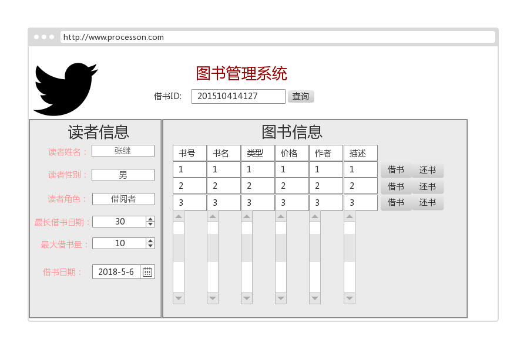

## 实验五：图书管理系统数据库设计与界面设计

|学号|班级|姓名|
|:---------------:|:------------:|:------------:|
|201510511127|软件15-1|张继|

### 1.数据库表设计

## 1.1. 图书描述类表
|字段|类型|主键，外键|可以为空|默认值|约束|说明|
|:-------:|:-------------:|:------:|:----:|:---:|:----:|:-----|
|ISBN|varchar(50)|主键|否|||图书描述类表的主键，标记唯一记录|
|bookName|varchar(50)| |否|||图书的属性书名|
|Type|varchar(50)| |否|||图书的属性类型|
|describe|varchar(200)| |否|||对图书的相关描述和简介|
|price|double| |否|||图书的价格|
|author|varchar(50)| |否|||图书的作者|
|catalog|varchar(50)| |否|||图书的目录|

**1.2 图书信息类表**

|字段|类型|主键，外键|可以为空|约束|说明|
|:-------:|:-------------:|:------:|:----:|:---:|:-----|
|ISBN|int(50)|主键|否||图书描述类表的主键，标记唯一记录|
|bookDes|varchar(50)| |否|||
|status|varchar(50)| |否|||


**1.3 借阅者类表**

|字段|类型|主键，外键|可以为空|约束|说明|
|:-------:|:-------------:|:------:|:----:|:---:|:-----|
|ID|varchar(50)|主键|否|||借阅者的借书卡号，借阅者信息表的主键|
|name|varchar(50)| |否|||借阅者姓名|
|sex|varchar(50)| |否|||借阅者性别|
|role|varchar(50)| |否|||借阅者角色|
|maxBorrowNum|int| |是|||对借阅者的最大限制借书量|
|maxBorrowDays|int| |是|||借阅时限|
|borrowNum|int| |是|||借阅者的借书量|


**1.4 管理员表**

|字段|类型|主键，外键|可以为空|约束|说明|
|:-------:|:-------------:|:------:|:----:|:---:|:-----|
|username|varchar(50)|主键|否||管理员姓名|
|password|varchar(100)| |否||管理员密码|


**1.5 超级管理员表**

|字段|类型|主键，外键|可以为空|约束|说明|
|:-------:|:-------------:|:------:|:----:|:---:|:-----|
|username|varchar(50)|主键|否||超级管理员姓名|
|password|varchar(100)| |否||超级管理员密码|

**1.6 借阅信息类表**

|字段|类型|主键，外键|可以为空|约束|说明|
|:-------:|:-------------:|:------:|:----:|:---:|:-----|
|readerId|varchar(50)|外键|否||借阅者的借书卡号，借阅信息类表的主键|
|ISBN|varchar(100)| |否||书号，借阅信息类表的外键，与图书描述类表相关联|
|lendData|int| |否||借书日期|
|returnData|int| |否||还书日期|
|isOvertime|varchar(50)| |否||是否超时|

**1.7 预借信息类表**

|字段|类型|主键，外键|可以为空|约束|说明|
|:-------:|:-------------:|:------:|:----:|:---:|:-----|
|readerId|varchar(50)|外键|否||借阅者的借书卡号，借阅信息类表的主键|
|ISBN|varchar(100)| |否||书号，借阅信息类表的外键，与图书描述类表相关联|
|number|int| |否||数量|
|data|int| |否||日期|


***

## 2. 界面设计
## 2.1. 借书界面设计

- 用例图参见：借书用例
- 类图参见：借书类，读者类
- 顺序图参见：借书顺序图
- API接口如下：

1. 借阅者API

- 功能：获取用户基本信息
- 请求地址： http://localhost:8080/bookManage/v1/api/user_list
- 请求方法：GET
- 请求参数：

|参数名称|必填|说明|
|:-------:|:-------------: | :----------:|
|ID|是|借阅者的uid|
|access_roken|是|用于验证请求合法性的认证信息。 |
|method|是|固定为 “GET”。|

- 返回示例：
```
{
  "data": [
        {
            "uid": "201510414127",
            "nickname": "张继",
           
          
        }
    ],
    "code": 200
}
```
- 返回参数说明：

|参数名称|说明|
|:-------:|:-------------: |
|data|用户的个人基本信息|
|code|返回码|

2. 验证API
- 功能：用于验证借阅者id是否存在
- 请求地址： http://localhost:8080/bookManage/v1/api/checking
- 请求方法：POST
- 请求参数：

|参数名称|必填|说明|
|:-------:|:-------------: | :----------:|
|ID|是|借阅者的uid|
|action|是|固定为 “checkID”。|
|access_token|是|用于验证请求合法性的认证信息。 |
|method|是|固定为 “GET”。|

- 返回实例：
```
{
    "info":"验证成功",
    "code":200
}
```
- 返回参数说明：

|参数名称|说明|
|:-------:|:-------------: |
|Info|返回信息|
|code|返回码|


