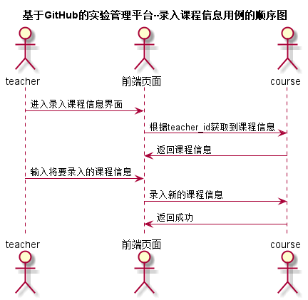

# “录入课程信息”用例 [返回](../README.md)

## 1. 用例规约

|用例名称|登录|
|-------|:-------------|
|功能|添加课程信息|
|参与者|教师|
|前置条件| 教师登录|
|后置条件|添加课程成功|
|主流事件| |
|备注| |

## 2. 业务流程 [源码](../src/录入课程信息.puml)
 

## 3. 界面设计
- 界面参照:https://zhangji123456.github.io/is_analysis/test6/ui/录入课程信息.html
- API接口调用
    - 接口：[addCourse](../jiekou/addCourse.md)
    
## 4. 算法描述 

    
## 5. 参照表
- [COURSES](../数据库设计.md/#COURSES)
