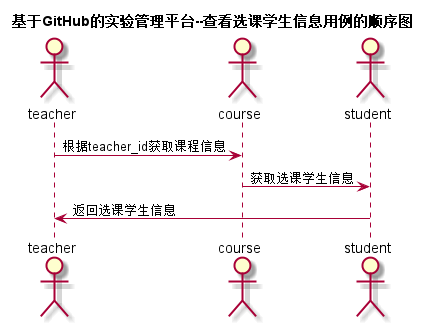

# “查看选课学生信息”用例 [返回](../README.md)
## 1. 用例规约

|用例名称|查看选课学生信息|
|-------|:-------------|
|功能|查看选课学生信息|
|参与者|教师|
|前置条件|必须先登录|
|后置条件| |
|主流事件| |
|备注| |

## 2. 业务流程 [源码](../src/查看选课学生信息.puml)
 

## 3. 界面设计
- 界面参照:  https://zhangji123456.github.io/is_analysis/test6/ui/查看选课学生信息.html
- API接口调用
    - 接口1：[courseSelectionInfo](../jiekou/courseSelectionInfo.md) 

## 4. 算法描述
无
    
## 5. 参照表
- [STUDENTS](../数据库设计.md/#STUDENTS)
- [COURSES](../数据库设计.md/#COURSES)
- [TEACHERS](../数据库设计.md/#TEACHERS)

