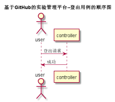

# “登出”用例 [返回](../README.md)

## 1. 用例规约

|用例名称|登出|
|-------|:-------------|
|功能|已经登录的用户登出实验管理平台|
|参与者|学生/老师|
|前置条件| |
|后置条件|登出后，跳转到登录页面|
|主流事件| |
|备注| |

## 2. 业务流程（顺序图） [源码](../src/登出.puml)
 

## 3. 界面设计
- 界面参照: 
- API接口调用
    - 接口1：[logout](../jiekou/logout.md) 

## 4. 算法描述
    
## 5. 参照表

- [USERS](../数据库设计.md/#USERS)
