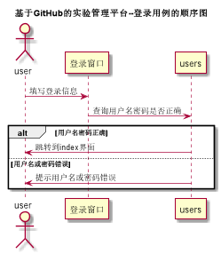
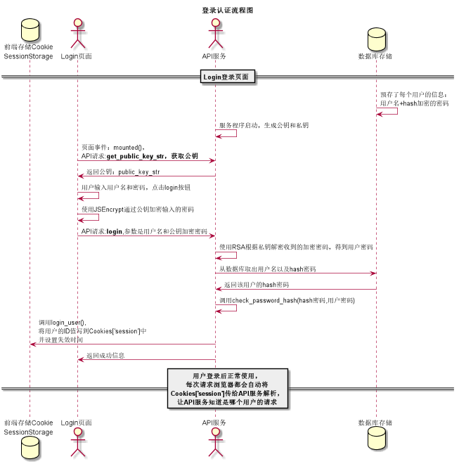

# “登录”用例 [返回](../README.md)

## 1. 用例规约

|用例名称|登录|
|-------|:-------------|
|功能|登录平台|
|参与者|访客|
|前置条件| |
|后置条件|登录成功后，跳转到主页|
|主流事件| |
|备注| |

## 2. 业务流程（顺序图） [源码](../src/登录.puml)
 

## 3. 界面设计
- 界面参照: 
- API接口调用
    - 接口：[login](../接口/login.md)
    
## 4. 算法描述 [源码](../src/登录认证流程图.puml)

    
## 5. 参照表

- [USERS](../数据库设计.md/#USERS)

