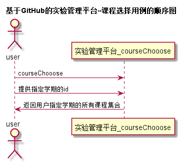

# “课程选择”用例 [返回](./README.md)
## 1. 用例规约
|用例名称|课程选择|
|-------|:-------------|
|功能|用户登录之后需要确定操作的课程名称|
|参与者|学生，老师|
|前置条件|学生，老师需要先登录且已选择课程|
|后置条件| 获取成功，显示该用户的所有关联课程|
|主流事件| |
|备注| |

## 2. 业务流程（顺序图） [源码](../src/课程选择.puml)
 

## 3. 界面设计
- 界面参照: https://zhangji123456.github.io/is_analysis/test6/ui/课程选择.html
- 接口：[getCourses](../jiekou/getCourses.md)

## 4. 算法描述（活动图）

## 5. 参照表
- [STUDENTS](../数据库设计.md/#STUDENTS)
- [TEACHERS](../数据库设计.md/#TEACHERS)
- [COURSES](../数据库设计.md/#COURSES)

